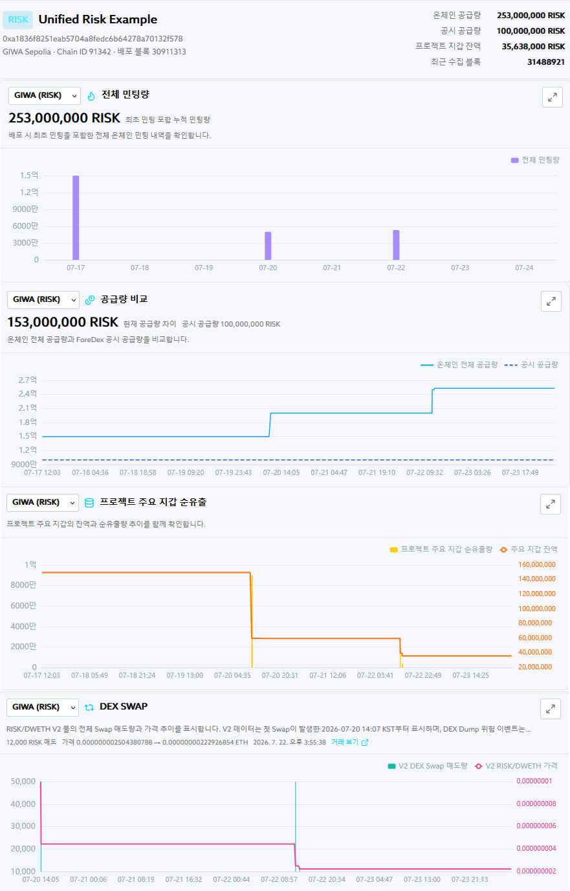

# GIWA Sepolia Demo Environment

## Demo Objective

Rather than asserting a risk determination about a real project, the demo intentionally creates on-chain anomaly conditions in a controlled test environment. It then presents how data collection, rule evaluation, dashboard display, and Explorer-based on-chain verification are connected.

## Core Configuration

- **Network:** GIWA Sepolia testnet, Chain ID `91342`
- **Test token:** `Unified Risk Example` (`RISK`), 18 decimals
- **Token contract:** [`0xa1836f8251eab5704A8Fedc6b64278A70132f578`](https://sepolia-explorer.giwa.io/address/0xa1836f8251eab5704A8Fedc6b64278A70132f578?tab=contract), verified non-proxy contract
- **Demo-disclosed supply baseline:** `100,000,000 RISK` — comparison baseline for the demo
- **Initial minted supply:** `150,000,000 RISK` — configured to create a supply discrepancy
- **Additional minting capability:** `mint(address,uint256)` is restricted by `onlyOwner`, with no enforced on-chain cap
- **Owner and Treasury snapshot:** `owner()` and `treasury()` at Block `31,403,117`: [`0x8Bc3dF18Bf41aB83eda4919e9BD92905a79BB443`](https://sepolia-explorer.giwa.io/address/0x8Bc3dF18Bf41aB83eda4919e9BD92905a79BB443)
- **DEX environment:** A Demo V2 `RISK/DWETH` pool intentionally configured with low liquidity

## Interpreting Supply Figures

`100,000,000 RISK` is the comparison baseline serving as the demo-disclosed supply. `150,000,000 RISK` is the initial minted supply configured to intentionally create a discrepancy. In the verified source code, the two values are declared as the `DISCLOSED_SUPPLY` and `ACTUAL_INITIAL_SUPPLY` constants, respectively, and the constructor mints the initial `150,000,000 RISK`.

In the verification snapshot at `2026-07-22 19:25:15 UTC` (Block `31,403,199`), the on-chain total supply, including additional minting, was `253,000,000 RISK`. The following three values must therefore remain distinct.

- **`100,000,000 RISK`:** Demo-disclosed supply registered for monitoring and the configured max supply
- **`150,000,000 RISK`:** Initial minted supply at deployment
- **`253,000,000 RISK`:** Total supply in the `2026-07-22 19:25:15 UTC`, Block `31,403,199` snapshot

The dashboard's `100,000,000 RISK` max supply is a monitoring configuration, not an issuance cap enforced by the contract. At `2026-07-22 19:23:53 UTC`, Block `31,403,117`, the observed Owner could execute the `onlyOwner` minting function. The Owner state may change after that block.

## Public Demo DEX Configuration

- **Demo V2 Pool:** [`0x1c75c9984b2e43a8606FdD6d7946c02532a80CB1`](https://sepolia-explorer.giwa.io/address/0x1c75c9984b2e43a8606FdD6d7946c02532a80CB1)
- **Demo V2 Router:** [`0x0f6c248912D555878f6ea9F1272D4a9b28549349`](https://sepolia-explorer.giwa.io/address/0x0f6c248912D555878f6ea9F1272D4a9b28549349)
- **Demo V2 Factory:** [`0xA7b4E8A3eC9CeeEAaF1F03e19C2c85D31a082565`](https://sepolia-explorer.giwa.io/address/0xA7b4E8A3eC9CeeEAaF1F03e19C2c85D31a082565)
- **Demo Wrapped Ether (`DWETH`):** [`0x4A954C249a462c028247F292652daf94db1bab9f`](https://sepolia-explorer.giwa.io/address/0x4A954C249a462c028247F292652daf94db1bab9f)

## Test Token

GIWA Sepolia test tokens are development and validation assets with no economic value. The testnet may experience delays, errors, chain reorganizations, rollbacks, or data resets.

Sources: [Connect to the GIWA Network](https://docs.giwa.io/get-started/connect-to-giwa) · [GIWA Testnet Terms of Use](https://docs.giwa.io/terms-and-policies/testnet-terms-of-use) · [RISK Contract](https://sepolia-explorer.giwa.io/address/0xa1836f8251eab5704A8Fedc6b64278A70132f578?tab=contract)
