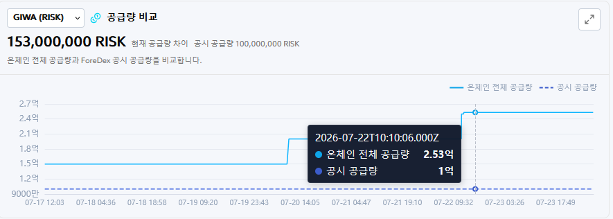
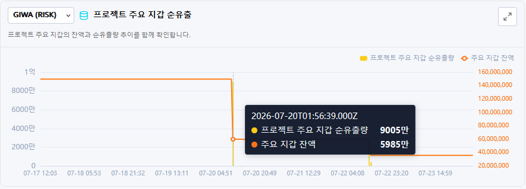

# Detection Scenarios

The four scenarios do not reproduce illegal conduct or project distress involving a real project. They are **purpose-built demo scenarios** designed to validate the monitoring workflow. All thresholds and time windows are illustrative.

## 1. Supply Discrepancy

**Observed data:** Difference between the registered demo-disclosed supply and the on-chain total supply

**Demo condition:** Configure the demo-disclosed supply baseline as `100,000,000 RISK` and the initial minted supply as `150,000,000 RISK`.

**Illustrative decision rule:** A supply excess of at least `0.1%` over the demo-disclosed supply produces a WARNING, while at least `5%` produces a CRITICAL. Exceeding the registered max supply of `100,000,000 RISK` produces a CRITICAL regardless of the excess percentage.

In the current demo, both the demo-disclosed supply and max supply are `100,000,000 RISK`. Any positive excess therefore activates the max-supply condition and produces a CRITICAL before the percentage tiers affect the result. The WARNING and CRITICAL percentage tiers describe the general configuration logic.

**Result interpretation:** A discrepancy is a signal requiring review. Potentially legitimate explanations—including the disclosure reference date, units, burns, bridges, lockups, and migrations—must be investigated separately.

## 2. Anomalous Minting

**Observed data:** New token issuance by an authorized address and changes in cumulative supply

**Demo condition:** Configure the Owner or another address with minting authority to execute additional minting after the initial deployment.

**Illustrative decision rule:** Cumulative minted supply of at least `90%` of the demo-disclosed supply produces a WARNING, while more than `100%` produces a CRITICAL. Under a supplementary 10-minute rule, additional minting divided by the on-chain total supply immediately before minting produces a WARNING at `1%` or more and a CRITICAL at `20%` or more. Cumulative minted supply does not decrease after tokens are burned.

**Result interpretation:** Large-scale additional minting outside a disclosed or approved issuance plan is an anomaly indicating an arbitrary expansion of the token supply. In particular, if newly issued tokens move through project-related wallets to a DEX or exchange deposit address, the activity may be interpreted as anomalous behavior associated with a potential market sale.

## 3. Large Net Outflow from a Project-Controlled Wallet

**Observed data:** Outflows relative to inflows from a project-controlled wallet during a configured time window

**Demo condition:** Generate a net outflow exceeding the illustrative threshold from a registered project-controlled wallet.

**Illustrative decision rule:** Within a 15-minute observation window, a net outflow of at least `10%` of the starting balance produces a WARNING, while at least `30%` produces a CRITICAL. Transfers to a DEX Pool are included; movements among registered internal wallets and mint and burn activity are excluded.

**Result interpretation:** When assets substantially exceeding the normal transaction size move from a core project wallet to external addresses within a short period, the activity is an anomaly indicating an abnormal outflow of project-held assets. In particular, repeated large net outflows without prior disclosure, or assets moving to exchange deposit addresses or a DEX, may be interpreted as anomalous behavior associated with insider selling, asset disposal, or liquidity withdrawal.

## 4. Concentrated DEX Sell-Off

**Observed data:** Liquidity in the registered `RISK/DWETH` pool and swap activity by project-associated addresses

**Demo condition:** Execute a RISK sale exceeding a configured size or ratio in a low-liquidity environment.

**Illustrative decision rule:** Both a price decline and the project-controlled wallet's sell ratio must satisfy their respective conditions within a five-minute observation window. A price decline of at least `10%` together with a sale equal to at least `5%` of the Pool's starting RISK reserve produces a WARNING; the corresponding CRITICAL thresholds are at least `20%` and `10%`. Only sales by registered project-controlled wallets are evaluated as risk events. Swaps by external wallets are reflected only in chart observations.

**Result interpretation:** When a project-related wallet executes a large sale through a DEX pool within a short period, the activity is an anomaly indicating concentrated disposal of its holdings. In particular, a high sell ratio relative to liquidity or repeated similar transactions may be interpreted as anomalous behavior associated with dumping or liquidity withdrawal that could cause market impact.

> **Threshold Notice**
>
> The percentages and time windows above are illustrative thresholds used to explain the demo's operation. They must be calibrated separately after reviewing each project's token structure, liquidity, operating policy, and distribution of normal activity.
