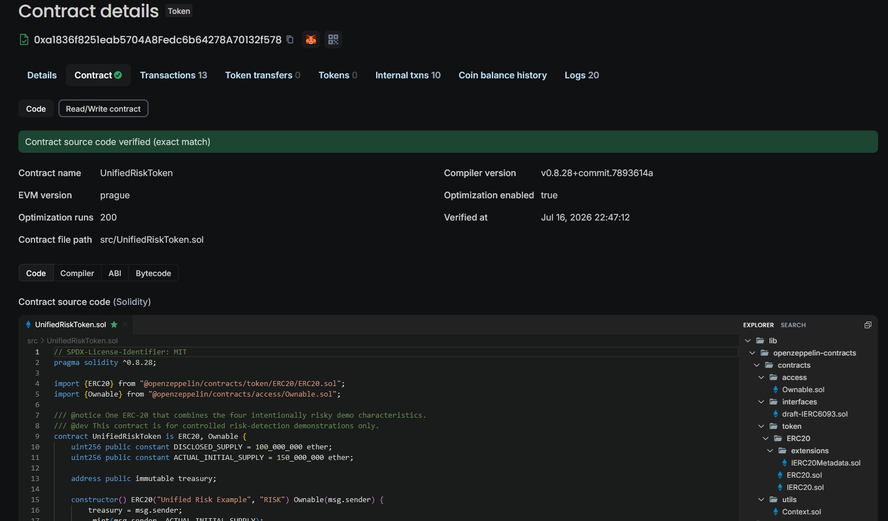

# Explorer-Based On-Chain Verification

## Reference Contract

- Address: [`0xa1836f8251eab5704A8Fedc6b64278A70132f578`](https://sepolia-explorer.giwa.io/address/0xa1836f8251eab5704A8Fedc6b64278A70132f578?tab=contract)
- Network: GIWA Sepolia
- Token: `Unified Risk Example` (`RISK`), 18 decimals
- Contract: verified, non-proxy, Solidity `0.8.28`
- Deployment: Block `30,911,313` · [deployment transaction](https://sepolia-explorer.giwa.io/tx/0x3bd540b53ff1efa21b01539607b18e9f0b19a5484a0149288ca1603b48bf7a60) · `2026-07-17 02:47:09 UTC`
- Owner and Treasury snapshot: [`0x8Bc3dF18Bf41aB83eda4919e9BD92905a79BB443`](https://sepolia-explorer.giwa.io/address/0x8Bc3dF18Bf41aB83eda4919e9BD92905a79BB443) at Block `31,403,117`

> [[GIWA Testnet Contract Link](https://sepolia-explorer.giwa.io/address/0xa1836f8251eab5704A8Fedc6b64278A70132f578?tab=contract)]

## Registered Demo Project-Controlled Wallets

| Role | Address | Verification status as of 2026-07-22 |
|---|---|---|
| Main Treasury · Owner · Minter · Seller · Liquidity Provider | [`0x8Bc3dF18Bf41aB83eda4919e9BD92905a79BB443`](https://sepolia-explorer.giwa.io/address/0x8Bc3dF18Bf41aB83eda4919e9BD92905a79BB443) | `ACTIVE_ONCHAIN` |
| Operations | [`0x6c53ceada39479cedd809dee33ccd8ba8ecfb500`](https://sepolia-explorer.giwa.io/address/0x6c53ceada39479cedd809dee33ccd8ba8ecfb500) | `CREATED_UNFUNDED` |
| Vesting | [`0x9e9be4e495784fd2a78ff9e50a80eca798b9f853`](https://sepolia-explorer.giwa.io/address/0x9e9be4e495784fd2a78ff9e50a80eca798b9f853) | `CREATED_UNFUNDED` |
| Liquidity | [`0xea84b0fa67e56289702debd942245f9c215e200b`](https://sepolia-explorer.giwa.io/address/0xea84b0fa67e56289702debd942245f9c215e200b) | `CREATED_UNFUNDED` |
| Marketing | [`0x39574ea1483e6a057bf2febc9b94b256da6b037`](https://sepolia-explorer.giwa.io/address/0x39574ea1483e6a057bf2febc9b94b256da6b037) | `CREATED_UNFUNDED` |

The five addresses form a demo Registry used to explain the detection scope. At the time of verification, on-chain activity was confirmed only for the Main Treasury address. The other four addresses must not be characterized as active operating wallets.

## Representative Transactions and Supporting Status Evidence

The transactions below are demo examples cross-checked between risk events from the public API and successful transactions in the GIWA Testnet Explorer.

| Rule | Severity | Verifiable example |
|---|---|---|
| Project-controlled wallet net outflow | WARNING | Block `31,358,156` · [`0xce0b00e39b060770647b0a609080c678e3329e0b49dbbcfce63f23027c97eb53`](https://sepolia-explorer.giwa.io/tx/0xce0b00e39b060770647b0a609080c678e3329e0b49dbbcfce63f23027c97eb53) — `4,000,000 RISK`, approximately `10.08%` of the starting balance |
| Project-controlled wallet net outflow | CRITICAL | Block `31,355,127` · [`0xb5b5205e97fb4f8bbbb572990aa814dd59ceea5554cc3b199200e93041ffd38e`](https://sepolia-explorer.giwa.io/tx/0xb5b5205e97fb4f8bbbb572990aa814dd59ceea5554cc3b199200e93041ffd38e) — `20,000,000 RISK`, approximately `33.50%` of the starting balance |
| Anomalous minting | CRITICAL | Block `31,355,139` · [`0x0a4fb68a0c110c103a7827991c51c93b9067626660e414af07688fa8316abdb6`](https://sepolia-explorer.giwa.io/tx/0x0a4fb68a0c110c103a7827991c51c93b9067626660e414af07688fa8316abdb6) — additional minting of `50,000,000 RISK`, equal to `50%` of the demo-disclosed supply and `25%` of the pre-mint total supply |
| Concentrated DEX sell-off | WARNING | Block `31,358,222` · [`0x1ec593d2c8585a5c381b998384be32c5c602509ded888915e26f13a9f4c942a7`](https://sepolia-explorer.giwa.io/tx/0x1ec593d2c8585a5c381b998384be32c5c602509ded888915e26f13a9f4c942a7) — `12,000 RISK`, approximately `10.98%` price decline and a sale equal to `6%` of the starting RISK reserve |
| Concentrated DEX sell-off | CRITICAL | Block `31,355,168` · [`0xb8578423633cc4df4149e9d46a367f3aa04557f65336f7e36b68cf71bd0ca536`](https://sepolia-explorer.giwa.io/tx/0xb8578423633cc4df4149e9d46a367f3aa04557f65336f7e36b68cf71bd0ca536) — `50,000 RISK`, approximately `43.70%` price decline and a sale equal to `33.33%` of the starting RISK reserve |
| Supply discrepancy | CRITICAL | This state-based event is verified against the supply state at [Block `31,358,185`](https://sepolia-explorer.giwa.io/block/31358185), rather than a single transaction |

Each percentage is drawn from the event-evaluation data at the relevant time. A recalculation based on current balances, reserves, prices, or total supply may produce a different value.
