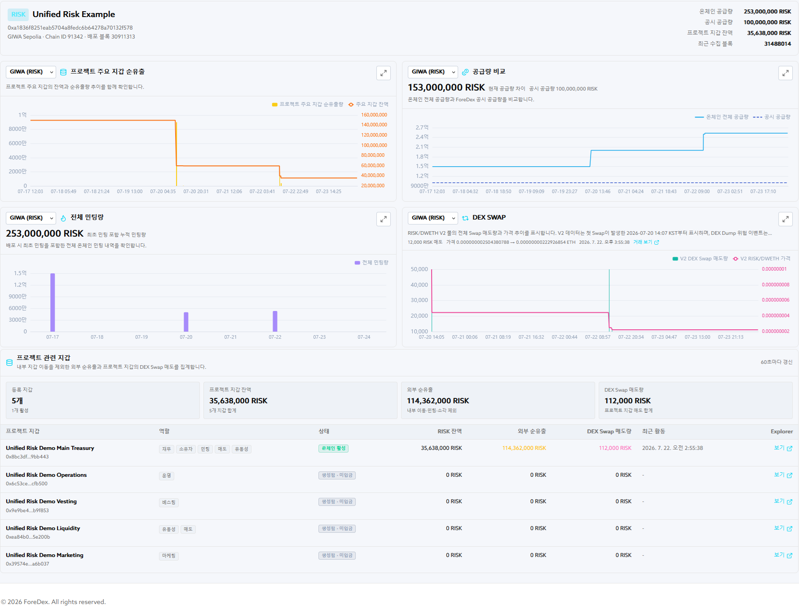

# System and Data Flow

## Processing Flow

1. **Define monitoring targets:** Register project-controlled wallets, token contracts, DEX pools, and comparison baselines.
2. **Collect on-chain data:** Collect balances, transfers, minting events, total supply, swaps, and liquidity-related data.
3. **Normalize and link data:** Associate address, token, and pool data at the project level and transform the records into comparable formats.
4. **Evaluate detection rules:** Evaluate supply discrepancy, anomalous minting, large net outflow from a project-controlled wallet, and concentrated DEX sell-off conditions.
5. **Present results:** Display the resulting states and supporting data on the dashboard.
6. **Perform on-chain verification:** Review contracts, events, and transactions in the Explorer.

## Primary Inputs

| Input | Role |
|---|---|
| Token contract | Review total supply, permissions, and transfer and minting events |
| Project-controlled wallets | Review inflows, outflows, and DEX interactions |
| Disclosed or registered supply | Comparison baseline for on-chain supply |
| DEX Pool, Router, and Factory | Review swap routes and the liquidity environment |
| Thresholds and time windows | Configure signal sensitivity |

## Meaning of the Output

A dashboard state is a **review-priority signal** produced by configured data and rules. It does not determine the intent or legal character of an event. An operator must also review the relevant addresses, transaction purpose, project disclosures, market conditions, and raw transactions.

## Current Demo and Target Architecture

Values in this demo are illustrative. The current demo presents data collection and four detection workflows centered on the RISK test token. The project aims to extend the same data model and verification workflow to project tokens, RWAs, stablecoins, and DeFi protocols.
